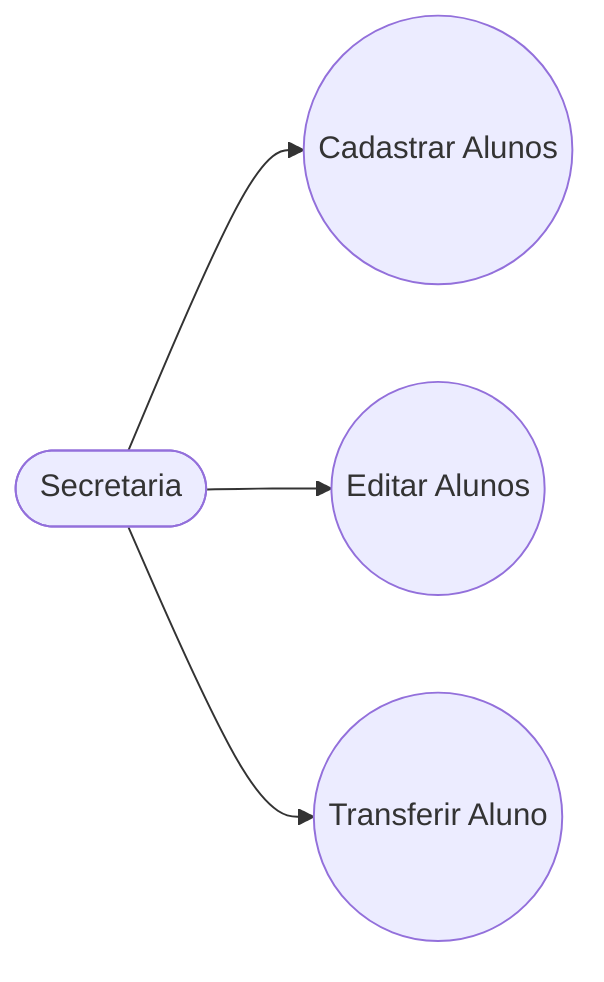
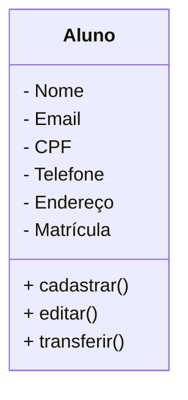

# Projeto Universidade

Modelagem em Orientação à objetos das Entidades Alunos, Cursos e Turmas.

## Caso de Uso

## Diagrama de Classes

## Dependencias
- **VSCODE**: IDE(Interface de Desenvolvivemento)

- **Mermaid**: Linguagem para confecção de Diagramas em documntos MD (Mark Down)

- **Matherial Icon Theme**: Tema para as Colorir as pastas.

-  **Git Lens**: Interface gráfica para o versionamento .git integrada ao VSCode.

