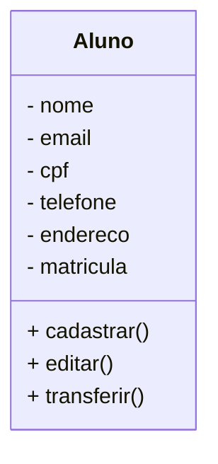

# Projeto Universidade

Modelagem em Orientação à objetos das Entidades Alunos, Cursos e Turmas.

## Caso de Uso

## Diagrama de Classes

# Funções MySQL

- **CREATE** - Cria tabelas dentro da base de dados.
- **INSERT** - Cria registros dentro das tabelas.

- **SELECT** - Permite visualizar os dados dentro das tabelas. Também permite filtrar os dados que quer visualizar.

- **ALTER** - Altera a estrutura das tabelas, adicionando ou removendo atributos(campos).
- **UPDATE** - Atualiza regristros dentro da tabela.

- **DROP** - Exclui a tabela ou a base de dados inteira.
- **DELETE** - Exclui registros dentro das tabelas.

# Conceitos MySQL

- Banco de Dados: Programa hospedado na máquina, com objetivo de persistir os dados fisicamente no HD.

- Base de Dados: Conjunto de tabelas.

- Tabelas: Conjunto de registros.

- Registros: Uma linha na tabela, contendo a informação dos seus atributos.

- Atributos: Uma das caracteristicas da tabela (Colunas).

## Bibliotecas Python

Este é um projeto desktop, utilizando as tecnologias:

- Python
- PySide6
- PyInstaller

## Dependencias

- **VSCODE**: IDE(Interface de Desenvolvivemento)

- **Mermaid**: Linguagem para confecção de Diagramas em documntos MD (Mark Down)

- **Matherial Icon Theme**: Tema para as Colorir as pastas.

- **Git Lens**: Interface gráfica para o versionamento .git integrada ao VSCode.

- **MySQL**:SGBD (Sistema Gerenciador Bancos de Dados). Permite conectar com o usuário com servidor MySQL, possibilitando criar bases de dados, tabelas, iniciar e modificar atributos e registros.